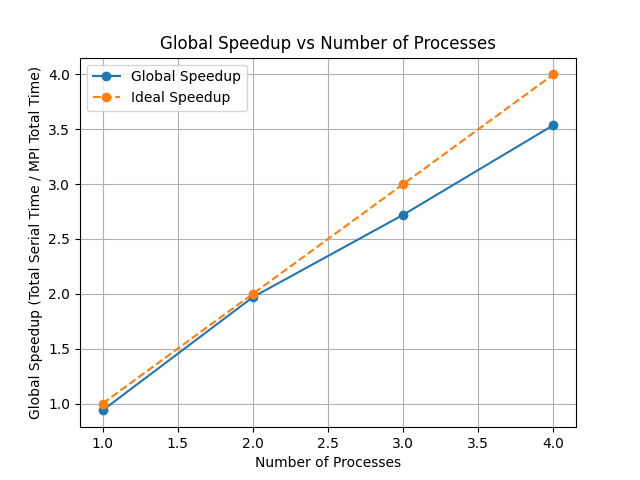

# Stratégie de parallélisation MPI pour le traitement vidéo

Dans notre implémentation, nous avons adopté une approche de parallélisation par décomposition de domaine en utilisant MPI pour traiter efficacement les images d'une vidéo. La stratégie consiste à distribuer équitablement les trames vidéo entre différents processus, chacun appliquant indépendamment le même filtre de netteté sur ses images assignées. Cette méthode est particulièrement pertinente car la fréquence d'entrée des trames vidéo est généralement bien supérieure à la capacité de traitement séquentiel, créant ainsi un goulot d'étranglement. Lorsque nous analysons le temps d'exécution global, nous constatons une réduction quasi-linéaire par rapport au nombre de processeurs utilisés, ce qui démontre l'efficacité de cette stratégie pour les traitements d'images indépendants où aucune communication entre les processus n'est requise pendant la phase de calcul.

En conclusion, l'approche de parallélisation par décomposition de domaine via MPI a permis d'atteindre une accélération quasi idéale. La distribution équilibrée des trames et le traitement indépendant de chaque segment se traduisent par une réduction significative du temps d'exécution, confirmant l'efficacité de cette stratégie pour des applications de traitement d'images intensives.