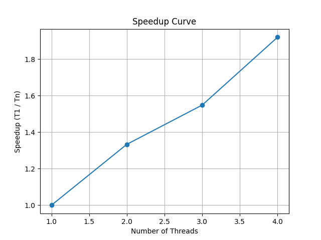

Notre stratégie de parallélisation MPI applique une décomposition par domaine spatial, où chaque processus traite une bande horizontale distincte de l'image. Contrairement à la version originale où seul le processus maître effectuait les opérations de convolution coûteuses, notre implémentation distribue toutes les étapes du pipeline (agrandissement, flou, accentuation) à l'ensemble des processeurs disponibles. L'équilibrage de charge est assuré par une répartition équitable des lignes de l'image, tandis que les communications sont minimisées à deux opérations collectives principales (diffusion initiale et rassemblement final). Cette stratégie présente toutefois quelques limites, notamment l'absence de traitement spécial pour les bordures entre les bandes, qui pourrait créer de légères discontinuités visuelles, et une granularité potentiellement trop fine avec un très grand nombre de processus. Néanmoins, elle offre un excellent compromis entre simplicité d'implémentation et performances pour ce type spécifique d'application de traitement d'image.

Les resultats son la:

