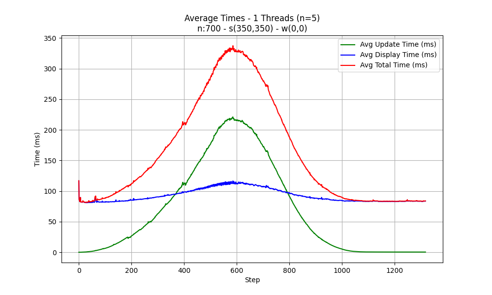

# Résultats de la Parallélisation de la Première Étape

## Introduction

Ce document présente les résultats obtenus suite à la parallélisation de la première étape de notre algorithme. Nous avons utilisé un script pour automatiser le processus d'évaluation des performances, permettant ainsi d'échantillonner 5 fois les performances du code avec un nombre de threads variant de 1 à 12, tout en faisant varier la taille de la grille (50, 100, 200, 400, 700, 1000).

## Méthodologie

À partir de ces échantillonnages, nous avons généré des graphiques montrant le temps moyen par étape. Ces graphiques nous permettent de visualiser la variation du temps de tracé ("plot") et du temps de mise à jour ("update").

## Analyse des Résultats

Dans les graphiques pour toutes les valeurs de N (50 à 1000), nous observons que la région centrale est celle où la mise à jour prend le plus de temps à s'exécuter. Cela s'explique par le fait que, durant ces étapes, le processus de mise à jour est le plus "memory-bound" possible (avec un "fire_front" très grand). Cette situation entraîne une sous-utilisation significative du processeur, car le problème principal réside dans le temps nécessaire pour lire les données de la RAM.

C'est généralement dans cette partie que le temps de mise à jour consomme beaucoup plus de temps que l'affichage. Pour un petit N comme 50, cela reste difficile à visualiser, mais au-delà de 100, c'est parfaitement visible.

## Illustrations pour N=700

À partir de maintenant, nous allons utiliser quelques images pour illustrer le processus. Elles concernent toutes N=700, mais les résultats sont très similaires pour tous les autres ensembles.

### Comparaison : Séquentiel vs Parallélisé (10 threads)

|  |  |
|---------------------------|---------------------------|

Ces graphiques montrent que la parallélisation a un effet réel sur la mise à jour, ce qui se traduit par une amélioration dans les régions centrales où la contrainte de mémoire est plus forte. Cependant, une parallélisation excessive détériore également les résultats en dehors du centre.

### Effet de la Parallélisation selon le Nombre de Threads et les Étapes

Le graphique suivant est composé de la moyenne de 5 exécutions pour chaque différence d'un thread :

### Analyse du Speedup par Étape

Nous pouvons également constater que le speedup par étape a un effet très positif dans la région centrale du graphique, tandis qu'il a un effet négatif vers les bords. Dans ces zones, le temps parallèle peut être pire que le temps séquentiel car de nombreux threads sont utilisés pour paralléliser peu de données, ce qui fait que le temps de synchronisation entre les threads devient prédominant et visible :

### Speedup dans la Région Centrale

Si nous nous limitons à la région centrale, où la parallélisation a des effets positifs, nous pouvons tracer le speedup en ne tenant compte que des étapes centrales :

Ici, il est possible d'analyser une tendance du speedup à atteindre des valeurs proches de 1,8, où la différence de gain pour plus de 4 threads est minime.

## Conclusion

Ces résultats peuvent nous conduire à plusieurs analyses selon la loi d'Amdahl/Gustafson. La parallélisation montre un avantage clair dans les régions à forte intensité de mémoire, mais présente un compromis dans les autres régions. Le speedup maximal obtenu d'environ 1,8 avec 4 threads suggère une limite dans notre capacité à paralléliser davantage cette partie de l'algorithme sans repenser l'approche ou l'architecture mémoire.