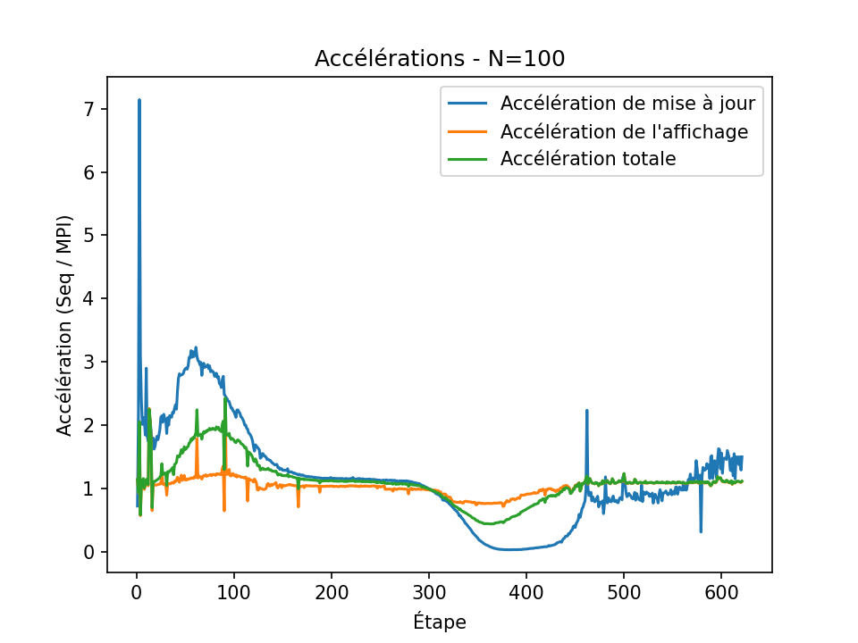
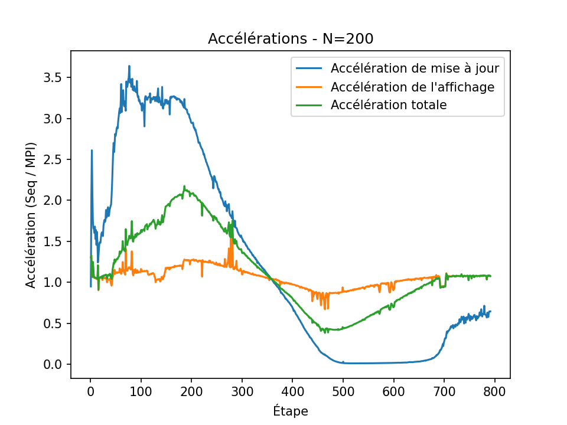
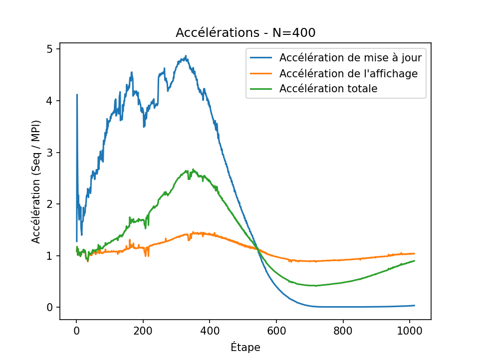
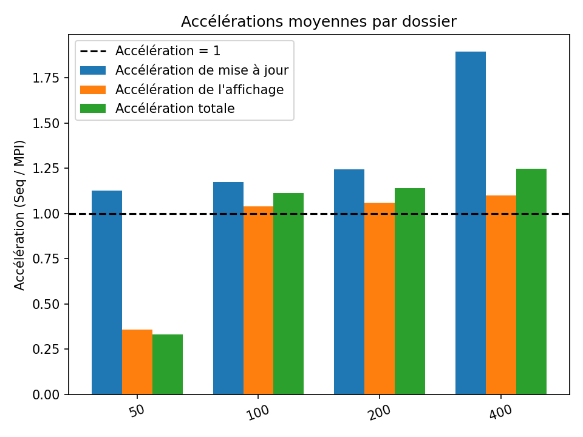

# Résultats

## Tableau de Synthèse

| N               | Accélération (update) | Accélération (display) | Accélération (total) |
|-----------------------|------------------------|-------------------------|-----------------------|
|    50    | 1.12    | 0.35  | 0.33  |
|    100   | 1.17    | 1.03  | 1.11  |
|    200   | 1.24    | 1.05  | 1.13  |
|    400   | 1.89    | 1.09  | 1.24  |

- **n = {50}**  
  - L’accélération totale est de 0.33 (inférieure à 1). Ici, MPI est donc plus lent que l’exécution séquentielle.
- **n = {100, 200, 400}**  
  - Dans ces trois cas, l’accélération totale est **> 1**, indiquant que MPI offre un gain de performance par rapport à la version séquentielle.

Malgré le cas de 50 pas où l’on observe un speedup < 1, il se dégage une tendance générale où **MPI offre une meilleure performance que le mode séquentiel** lorsque le nombre de pas devient plus important.

---

## Graphiques

### Graphiques Individuels par N

Pour chaque N, on dispose d’un tracé qui montre la variation de l’accélération (update, display et total) en fonction du nombre de pas.

####

|  | 
|---------------------------|---------------------------|---------------------------|

### Comparaison Globale

Ci-dessous, le graphique tiré de `global_speedups.png` montre l’accélération moyenne (pour les phases **update**, **display** et **total**) de chaque N, avec une ligne de référence à 1 :

---

---

## Conclusion

- Pour un petit nombre de pas (par exemple **50**), le coût de communication MPI peut dépasser le bénéfice de la parallélisation, ce qui conduit à une accélération < 1.  
- Dès que le nombre de pas augmente (100, 200, 400), l’**accélération MPI est **> 1**, confirmant que la parallélisation apporte un avantage notable.  

En résumé, bien qu’il y ait des cas où MPI est plus lent que la version séquentielle (notamment pour un trop petit nombre de pas), **l’implémentation parallèle offre en général de meilleures performances** que l’exécution séquentielle dès lors que la taille du problème est suffisamment importante.
