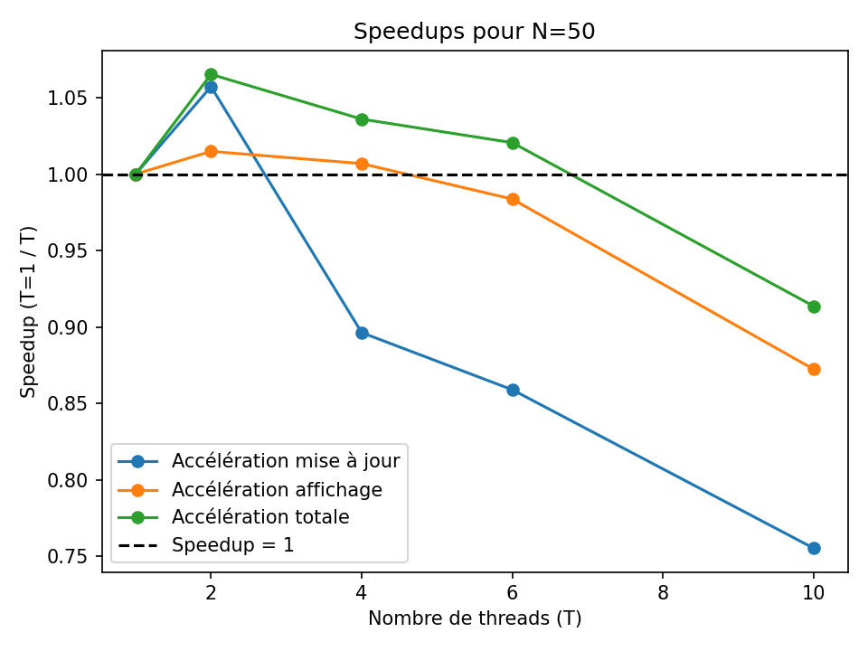

# README – Analyse des performances MPI + OpenMP

Dans cette étape, nous avons exploré une **approche hybride** combinant MPI (parallélisme par processus) et OpenMP (parallélisme par threads) dans le but d'améliorer la performance globale de l'application. L'objectif était d'exploiter simultanément les avantages des deux méthodes pour obtenir une accélération plus importante que celle obtenue séparément.

## Observations principales

Après avoir comparé les temps d'exécution et calculé les speedups entre :
- l'exécution en **OpenMP seul** (Étape 1),  
- l'exécution **hybride MPI + OpenMP** (cette étape),

nous avons constaté que, contrairement à nos attentes, **la version hybride n'apporte généralement pas d'amélioration significative des performances**. Au contraire, une **dégradation notable** apparaît fréquemment lorsqu’on active OpenMP par-dessus MPI.

## Analyse détaillée

Les graphiques suivants présentent les résultats des speedups obtenus pour différentes valeurs de \(N\) (taille du problème ou nombre d'itérations), en faisant varier le nombre de threads OpenMP :

- **speedups_N50.png**  
  

- **speedups_N100.png**  
  

- **speedups_N200.png**  
  

- **speedups_N400.png**  
  

Nous remarquons que le **speedup total** est souvent inférieur à **1** dès que le nombre de threads OpenMP augmente, ce qui indique une performance parfois inférieure à l’exécution séquentielle ou à l’utilisation d’OpenMP seul.

Le graphique **speedups_overall_by_threads.png** résume l'évolution du speedup total selon le nombre de threads pour chaque taille de problème :

- **speedups_overall_by_threads.png**  
  

Ces résultats mettent en évidence une diminution de la performance avec l'augmentation du nombre de threads, en particulier pour les valeurs modérées de \(N\).

## Comparaison : MPI seul vs MPI + OpenMP

Afin de déterminer précisément l'impact de l'ajout d'OpenMP à une application déjà parallélisée par MPI, nous comparons ici directement les versions **MPI seul** et **MPI + OpenMP**.

### Résultats des speedups MPI vs MPI + OpenMP

Les graphiques suivants comparent les speedups pour chaque taille de problème :

- **mpi_vs_mpi_plus_omp_speedups_N50.png**  
  

- **mpi_vs_mpi_plus_omp_speedups_N100.png**  
  

- **mpi_vs_mpi_plus_omp_speedups_N200.png**  
  

- **mpi_vs_mpi_plus_omp_speedups_N400.png**  
  

À partir de ces résultats, on observe clairement que :

- **La version hybride (MPI + OpenMP) ne garantit pas systématiquement une meilleure performance** que l'utilisation exclusive de MPI.
- La **surcharge** liée à la gestion simultanée des processus (MPI) et des threads (OpenMP) dépasse fréquemment les gains potentiels.
- Le bénéfice réel dépend fortement de la **granularité du problème** (taille de \(N\)) et du nombre total de threads et processus utilisés.

### Conclusion sur MPI vs MPI + OpenMP

Globalement, l'implémentation hybride **MPI + OpenMP** ne s'avère pas toujours efficace. Son intérêt pratique dépend fortement :

- de la **taille et complexité du problème**,
- du **nombre optimal de processus et de threads**,
- et surtout de la **répartition efficace des tâches**.

Un **profilage plus approfondi** ainsi qu'une **optimisation ciblée** sur le modèle hybride pourraient être nécessaires pour tirer pleinement parti de cette approche.

## Conclusion générale

L'intégration d'OpenMP sur une structure déjà parallélisée par MPI **n’a pas produit les performances escomptées** ; au contraire, on observe souvent une baisse significative de performance par rapport à la solution OpenMP seule. Plusieurs facteurs expliquent ces résultats :

- **Surcharge en synchronisation et communication** : L'utilisation combinée de MPI et OpenMP introduit des coûts supplémentaires non négligeables.
- **Granularité insuffisante** : Lorsque \(N\) n’est pas suffisamment grand, le bénéfice de la parallélisation est totalement absorbé par l’overhead supplémentaire.
- **Complexité accrue** : Multiplier les couches de parallélisme augmente la difficulté de réglage optimal (affinités, répartition des tâches, gestion mémoire, etc.).

Pour améliorer ces résultats à l'avenir, il serait recommandé de :

- procéder à un **profilage détaillé** du programme afin d'identifier précisément les goulets d’étranglement,
- envisager une **optimisation spécifique** à la structure hybride,
- ou **revenir à une parallélisation plus simple (MPI ou OpenMP seul)** si la complexité supplémentaire ne se justifie pas par les gains de performance obtenus.